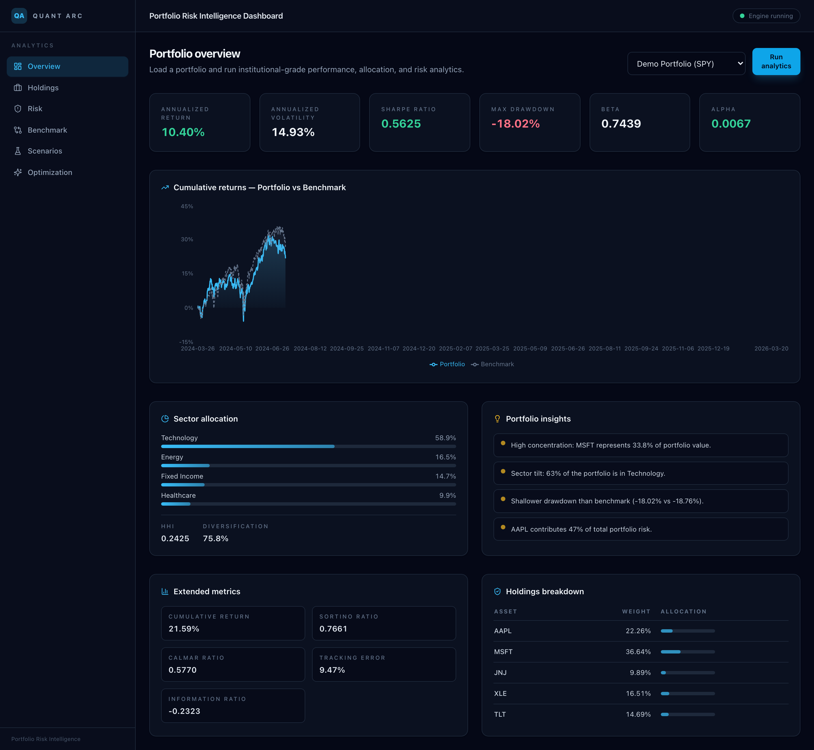
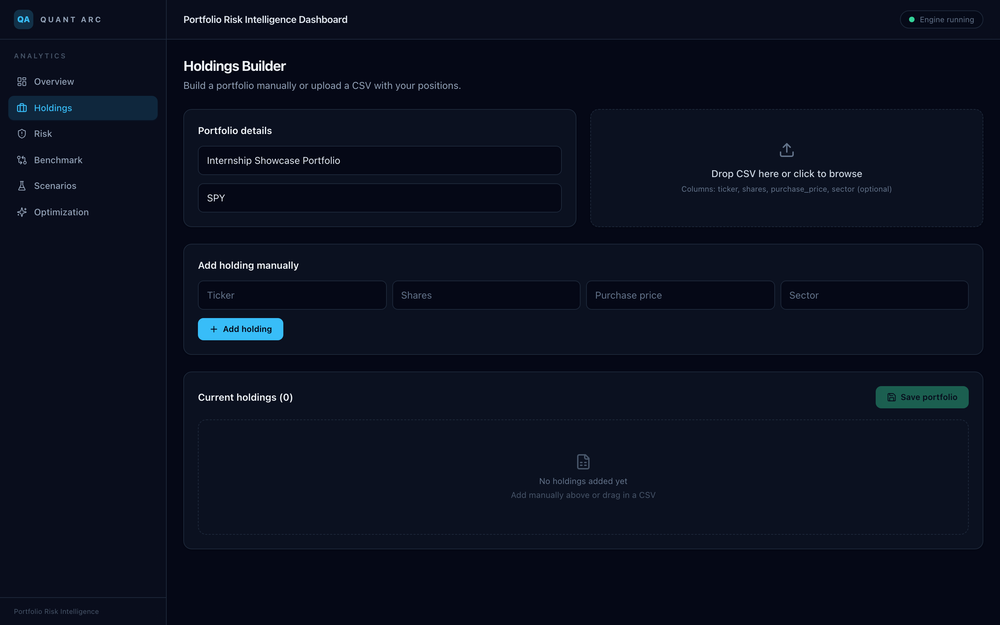
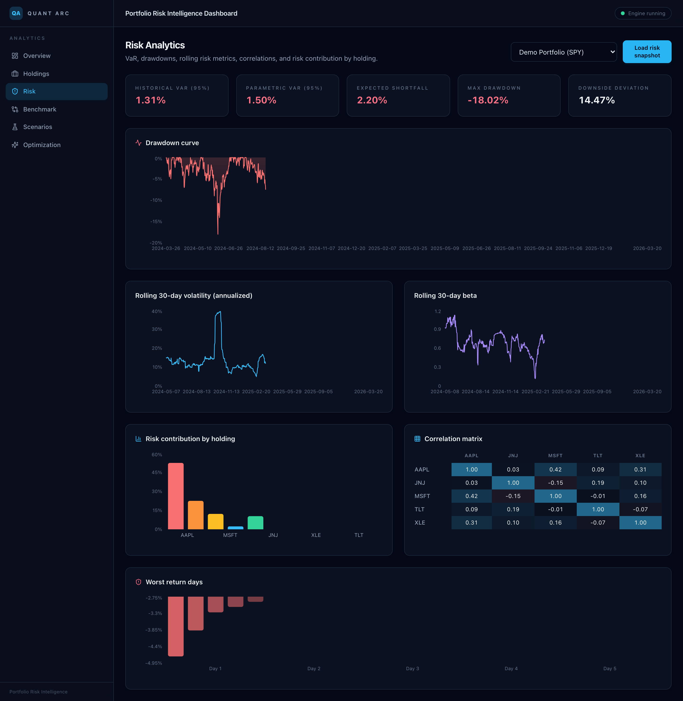
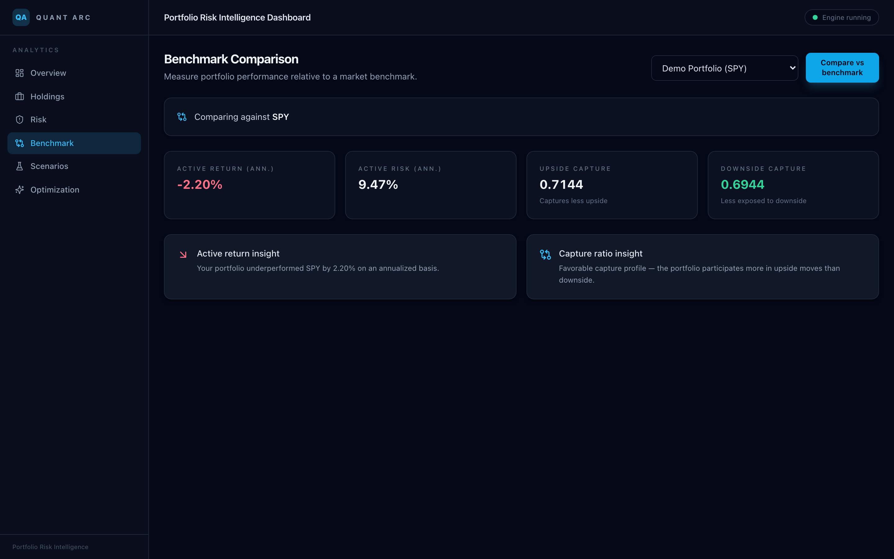
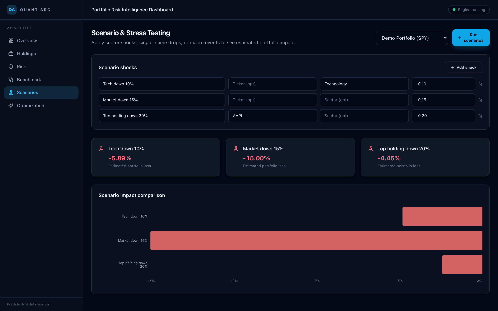
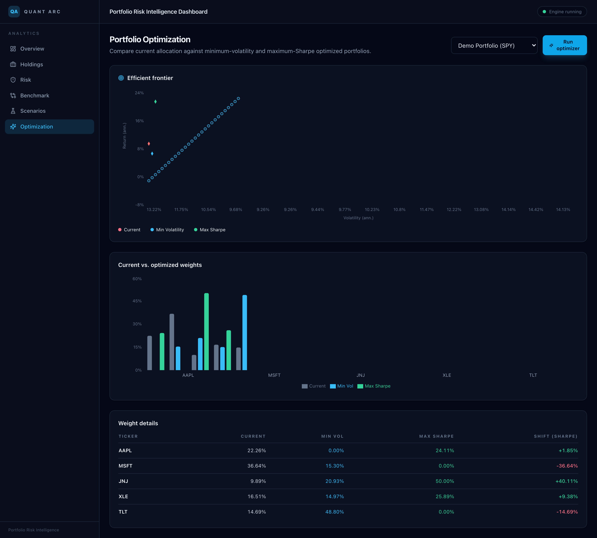

# Portfolio Risk Intelligence Dashboard

A production-style full-stack finance project focused on portfolio analytics, risk intelligence, and benchmark-relative decision support.

This project is designed to showcase skills relevant for finance analyst, portfolio analyst, investment analyst, and risk analyst internships.

## Screenshots

### Overview

Full portfolio overview with KPI strip, cumulative returns chart, sector allocation, insights, and holdings breakdown.



### Holdings Builder

Manual entry and CSV drag-and-drop upload for portfolio construction.



### Risk Analytics

VaR metrics, drawdown curve, rolling volatility/beta, risk contribution by holding, correlation matrix, and worst return days.



### Benchmark Comparison

Active return/risk, upside/downside capture ratios, and contextual insights vs. SPY.



### Scenario & Stress Testing

Custom scenario shock builder with estimated portfolio impact and comparison chart.



### Portfolio Optimization

Efficient frontier plot, current vs. optimized weight comparison, and detailed weight table.



---

## Tech Stack

- Frontend: Next.js (App Router), TypeScript, Tailwind CSS
- Backend: FastAPI, Python 3.11
- Analytics stack: pandas, numpy, scipy, statsmodels
- Data provider: Stooq (free, no API key — provider abstraction via `market_data` service)
- Database: PostgreSQL
- ORM: SQLAlchemy
- Infra: Docker + Docker Compose

## Core Features Implemented

- Portfolio creation with holdings payload
- CSV upload endpoint for holdings ingestion
- Historical price pull from Stooq
- Performance analytics:
  - cumulative return, annualized return, annualized volatility
  - Sharpe, Sortino, max drawdown, Calmar
  - beta/alpha, tracking error, information ratio
- Allocation analytics:
  - by asset, by sector
  - concentration via HHI
  - diversification score
- Risk analytics:
  - historical VaR, parametric VaR, expected shortfall
  - downside deviation, worst days
- Benchmark comparison:
  - active return, active risk
  - upside/downside capture
- Scenario testing with manual shocks
- Optimization:
  - minimum volatility weights
  - max Sharpe weights
  - current vs optimized comparison

## Project Structure

```text
.
├── backend/
│   ├── app/
│   │   ├── core/
│   │   ├── models/
│   │   ├── routers/
│   │   ├── schemas/
│   │   └── services/
│   ├── tests/
│   ├── Dockerfile
│   └── requirements.txt
├── frontend/
│   ├── app/
│   ├── components/
│   ├── lib/
│   └── Dockerfile
├── sample-data/
│   └── portfolio_sample.csv
├── docker-compose.yml
└── README.md
```

## API Endpoints

- `POST /portfolios` - create a portfolio and optional holdings
- `GET /portfolios` - list portfolios
- `GET /portfolios/{id}/holdings` - list holdings for portfolio
- `POST /portfolios/{id}/holdings/upload` - upload holdings CSV
- `GET /market-data/prices?tickers=AAPL,MSFT&period=1y` - retrieve recent adjusted close prices
- `GET /analytics/{id}/performance` - performance metrics
- `GET /analytics/{id}/allocation` - allocation and diversification metrics
- `GET /risk/{id}` - risk snapshot
- `GET /benchmark/{id}` - benchmark-relative analytics
- `POST /scenarios/{id}` - run scenario shocks
- `GET /optimization/{id}` - optimization recommendations

## Run with Docker

1. Start Docker Desktop.
2. From project root:

```bash
docker compose up --build
```

3. Open:
   - Frontend: `http://localhost:3000`
   - Backend docs: `http://localhost:8000/docs`

## Local Backend (without Docker)

```bash
cd backend
python -m venv .venv
source .venv/bin/activate
pip install -r requirements.txt
uvicorn app.main:app --reload --port 8000
```

## Local Frontend (without Docker)

```bash
cd frontend
npm install
npm run dev
```

## Testing

From `backend/`:

```bash
pytest
```

## Sample Workflow

1. Go to `Holdings` page and create a portfolio.
2. Note the returned portfolio ID.
3. Use:
   - `Overview` page to load portfolios and run performance metrics
   - `Risk` page for VaR and drawdown metrics
   - `Benchmark` page for relative analysis
   - `Scenarios` page for stress testing
   - `Optimization` page for suggested weights

## Notes

- Current market data provider is Stooq (free, no API key required).
- The service layer is separated so you can swap in a paid institutional data source later.
- The frontend is intentionally clean and recruiter-friendly, with a dark institutional dashboard style.

